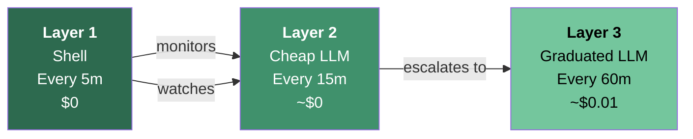
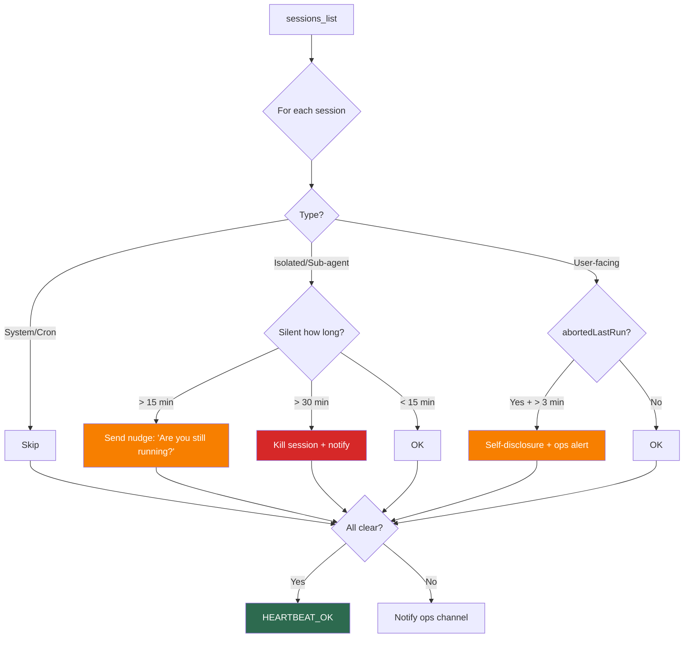
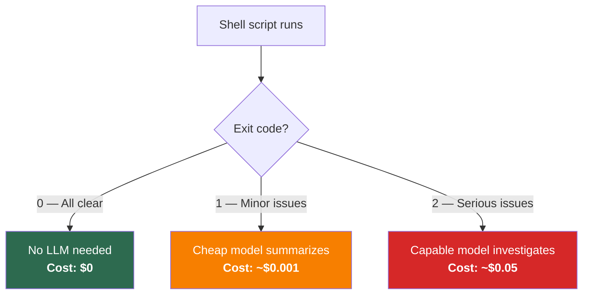
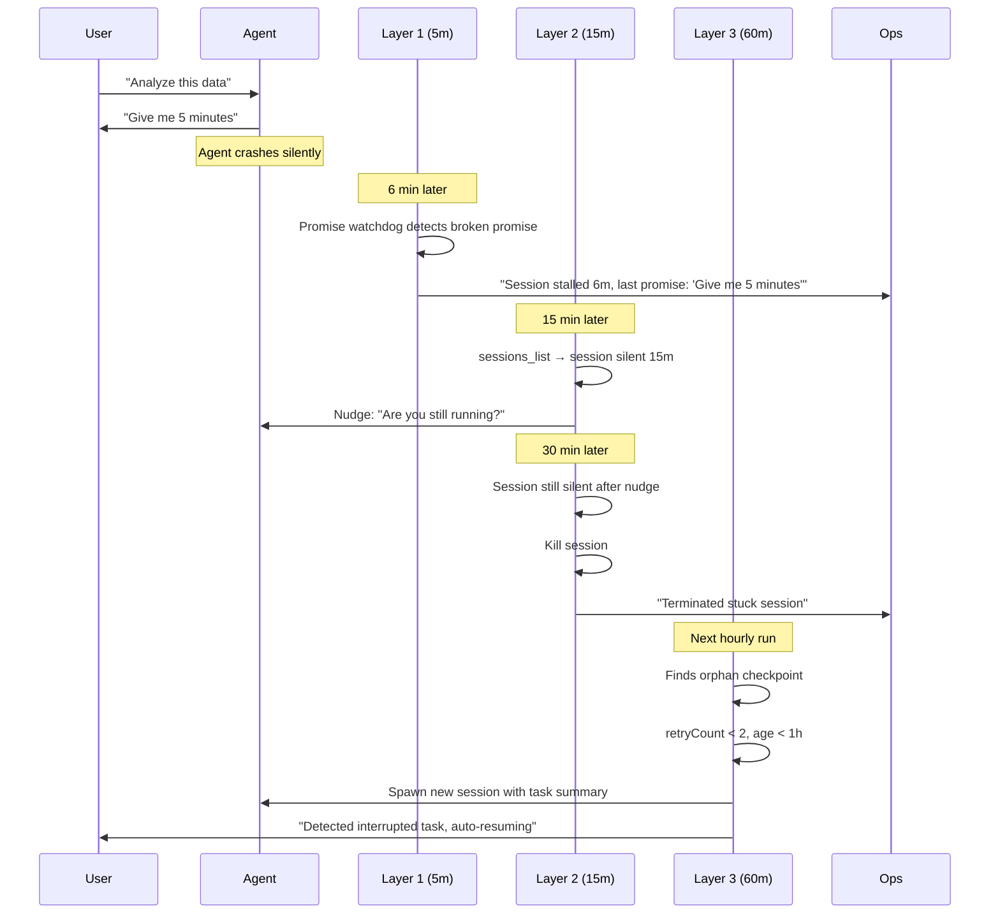

# Architecture: Three-Layer Self-Healing

## Overview

The self-healing system uses three layers with deliberately non-overlapping responsibilities. Each layer exists because the layers below it can't handle certain failure modes.

```
┌─────────────────────────────────────────────────────────────┐
│  Layer 3: Hourly Deep Analysis (graduated LLM, ~$0.01/run) │
│  Checkpoint archaeology, context overflow, disk, logs       │
├─────────────────────────────────────────────────────────────┤
│  Layer 2: LLM Heartbeat (cheap LLM, every 15m, ~$0/run)    │
│  Session liveness, stall detection, visibility pulse        │
├─────────────────────────────────────────────────────────────┤
│  Layer 1: Shell Watchdog (no LLM, every 5m, $0)            │
│  Process alive, HTTP health, heartbeat alive, promises      │
├─────────────────────────────────────────────────────────────┤
│  Layer 0: Built-in Health Monitor (continuous, $0)          │
│  Channel disconnect detection + auto-reconnect              │
└─────────────────────────────────────────────────────────────┘
```

### Why 5m → 15m → 60m?

Frequency follows a **3x progression** tied to cost:



- **The cheaper the layer, the more often it runs.** L1 is $0, so it runs 12x more often than L3.
- **L1 monitors L2.** If the LLM heartbeat dies silently, L1 detects it within 5 minutes.
- **Each layer has 3x the budget of the one below it.** This prevents monitoring from becoming more expensive than what it monitors.

---

## Layer 0: Built-in Health Monitor

**Frequency**: Continuous (event-driven)
**Cost**: $0
**Model**: None

The simplest layer. Your agent platform's built-in connection monitor. It detects disconnections from messaging channels (Discord, Telegram, Slack) and auto-reconnects.

This is table stakes. If your platform doesn't have this, add a TCP/WebSocket keepalive check.

**What it catches**: Network disconnects, channel timeouts, auth token expiry.

**What it misses**: Everything above the transport layer.

---

## Layer 1: Shell Watchdog

**Frequency**: Every 5 minutes via cron
**Cost**: $0
**Model**: None
**Script**: [process-watchdog.sh](../scripts/process-watchdog.sh)

The workhorse layer. Pure shell + Node.js, no LLM calls, zero cost. Runs most frequently because it costs nothing.

### Check 1: Process Alive

```bash
pgrep -f "your-agent-process" -u "$(id -u)"
```

If the process is gone, alert immediately.

### Check 2: HTTP Health

```bash
curl -sf --max-time 5 "http://127.0.0.1:${PORT}/" > /dev/null
```

Process can be alive but not serving. This catches zombie processes, hung event loops, and port conflicts.

### Check 3: Heartbeat Activity

Scan the agent's log file for recent heartbeat markers. If the LLM heartbeat (Layer 2) hasn't fired in 20 minutes, something is wrong with the monitor itself.

```bash
tail -500 "$LOG_FILE" | grep -c "HEARTBEAT_OK"
```

This is "monitoring the monitor" -- Layer 1 watches Layer 2, catching cases where the heartbeat itself has failed silently. The 20-minute window is slightly longer than L2's 15-minute cycle, allowing one missed cycle before alerting.

### Check 4: Restart Storm Detection

Count restart signals in recent logs. More than 4 restarts in an hour indicates a crash loop.

```bash
tail -1000 "$LOG_FILE" | grep -c "signal SIGTERM received"
```

### Check 5: Promise Detection (Node.js)

The most novel part. The [promise-watchdog.mjs](../scripts/promise-watchdog.mjs) reads agent conversation transcripts and detects:

- **Pending replies**: User sent a message, agent never responded (>6 minutes)
- **Broken promises**: Agent said "I'll be right back" / "give me 5 minutes" and went silent (>7 minutes)

See [Promise Detection](promise-detection.md) for the full pattern.

### Alert Deduplication

Same alert is suppressed for 30 minutes (SHA1 signature + cooldown). This prevents alert storms during sustained outages.

---

## Layer 2: LLM Heartbeat

**Frequency**: Every 15 minutes
**Cost**: ~$0/month (free-tier cheap model)
**Model**: Any cheap model (gemini-flash, haiku, etc.)
**Template**: [heartbeat-prompt.md](../templates/heartbeat-prompt.md)

This is the only layer that uses an LLM for routine monitoring. It does **one thing**: check if agent sessions are alive and responsive.

### What it does



1. List all active sessions
2. Skip system sessions (main, heartbeat, cron)
3. For each isolated/sub-agent session:
   - Silent >15 minutes → send nudge message ("Are you still running?")
   - Silent >30 minutes → kill the session + notify
4. For user-facing sessions with `abortedLastRun`:
   - Send self-disclosure message + alert to ops channel
5. Every 30 minutes (every 2nd run): send visibility pulse ("N sessions active")

### What it does NOT do

This is critical. The heartbeat prompt is designed with a **prohibition-first** approach:

- No file reads/writes
- No code execution
- No web searches
- No image generation
- No gateway operations

See [Prohibition-First Prompts](prohibition-first-prompts.md) for why this matters.

### Normal output

When everything is fine:

```
HEARTBEAT_OK
```

No message sent, no notification, no log noise.

---

## Layer 3: Hourly Deep Analysis

**Frequency**: Every 60 minutes
**Cost**: ~$0.01/run (graduated model selection)
**Model**: Cheap → medium → expensive (based on findings)

Layer 3 handles everything too complex or too slow for 15-minute cycles:

### Checkpoint Management

Scan for orphaned checkpoints -- task state files where the session has died. Depending on age and retry count, either auto-resume or notify.

| Condition | Action |
|-----------|--------|
| Checkpoint ≤ 1 hour, retries < 2, no human input needed | Auto-resume: spawn new session with task summary |
| Checkpoint > 1 hour | Archive + notify |
| Needs human input | Notify only |
| Retries ≥ 2 | Notify only (prevent infinite loops) |

### Context Guardian

Monitor context window usage across active sessions:

| Usage | Action |
|-------|--------|
| < 60% | Normal |
| 60-80% | Log but no action |
| > 80% | Notify: suggest compact or new session |

### Log Deep Analysis

Scan error logs for patterns from the [Failure Catalog](failure-catalog.md). Count occurrences, detect new patterns, and escalate if thresholds are exceeded.

### Sentinel Staleness

Check if routine maintenance tasks (daily cleanup, weekly optimization) have actually run. If a sentinel file is too old, the maintenance pipeline has broken.

### Graduated Model Selection



Most hours produce exit 0 -- the shell script finds nothing wrong and the LLM is never called.

---

## Escalation Flow

When a session goes silent, this is the full timeline:



---

## Safety Mechanisms

### Quiet Hours

Layers 2 and 3 reduce activity during quiet hours (configurable, default 23:00-08:00):
- Layer 1 continues (process monitoring never sleeps)
- Layer 2 runs but skips kill operations
- Layer 3 skips auto-resume (don't restart tasks while the user sleeps)

### Maximum Restarts

Each task thread has a maximum of 2 auto-restarts. The count is tracked statelessly by counting recovery markers in the thread history.

### Pulse Limits

Visibility pulses are capped at 10 per task. After 10 pulses, the system assumes the task is either very long-running (expected) or truly stuck (needs human attention).

---

## Layer Interaction Matrix

| Check | L0 | L1 (5m) | L2 (15m) | L3 (60m) |
|-------|:--:|:-------:|:--------:|:--------:|
| Channel disconnect | X | | | |
| Process alive | | X | | |
| HTTP health | | X | | |
| Heartbeat alive | | X | | |
| Restart storm | | X | | |
| Promise detection | | X | | |
| Session liveness | | | X | |
| Sub-agent stall | | | X | |
| Visibility pulse | | | X | |
| Checkpoint orphans | | | | X |
| Context overflow | | | | X |
| Log pattern analysis | | | | X |
| Sentinel staleness | | | | X |
| Disk/memory usage | | | | X |

**The key rule**: no layer duplicates another's work. If you're tempted to add a check, ask which layer it belongs to based on: Does it need an LLM? How often must it run? How expensive is it?
