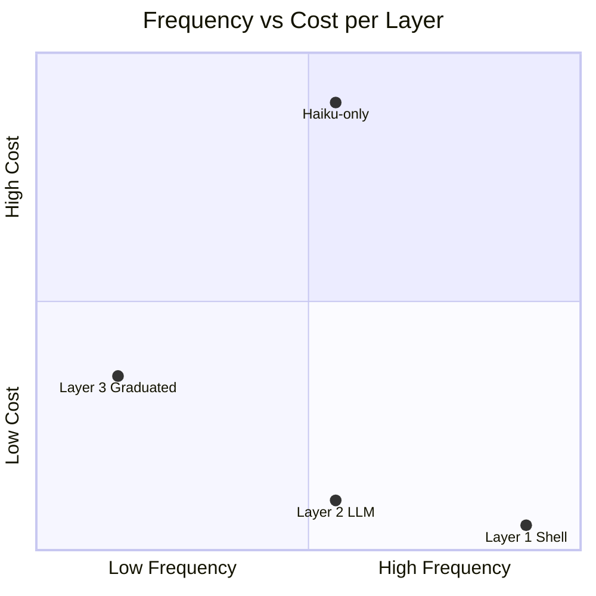

# Cost Architecture

## The Insight

Layer separation isn't just an engineering choice. **It's a cost containment strategy.** By separating "what needs an LLM" from "what needs a shell," you can monitor agents 24/7 for near-zero cost.

## Frequency × Cost Matrix



The ideal position is bottom-right: high frequency, low cost. Our three-layer design achieves this by distributing checks across cost tiers.

## The Cost Journey

We went through four iterations before arriving at the current design:

### Attempt 1: LLM-Only (gemini-flash)

```
Model:    gemini-flash (free tier)
Cost:     ~$0/month
Runs:     96/day (every 15 minutes)
Result:   FAILED — 80%+ error rate from tool hallucination
```

The free model was cheap but unreliable. It hallucinated tool calls, generated false alerts, and created more problems than it solved. See [Prohibition-First Prompts](prohibition-first-prompts.md) for details.

### Attempt 2: LLM-Only (haiku)

```
Model:    claude-haiku-4-5
Cost:     ~$0.06/run × 144 runs/day × 30 days = $260-335/month
Runs:     144/day
Result:   WORKED but too expensive
```

The capable model worked correctly. But $260-335/month for a heartbeat monitor is absurd. The monitoring system shouldn't cost more than the agents it monitors.

### Attempt 3: Shell-Only

```
Model:    None
Cost:     $0/month
Runs:     144/day
Result:   PARTIAL — can't detect semantic stalls
```

Shell scripts are fast and free. They catch process death, HTTP failures, and restart storms. But they can't detect "the agent said it would be back in 5 minutes and disappeared."

### Attempt 4: Shell + Cheap LLM (current)

```
Layer 1:  Shell watchdog (every 5m) — $0/month
Layer 2:  gemini-flash with prohibition-first prompt (every 15m) — ~$0/month
Layer 3:  Graduated (shell → cheap → expensive, every 60m) — ~$0.01/run when needed
Total:    ~$0-1/month
Result:   WORKS — each layer does only what it's uniquely suited for
```

The solution was splitting the problem. Shell handles infrastructure at the highest frequency ($0). A cheap LLM handles session liveness at moderate frequency (the ONE task it's good at). Expensive models only wake hourly for judgment calls.

The 3x frequency progression (5m → 15m → 60m) makes the design intention visible: **the cheaper the check, the more often it runs.**

## Cost Levers

### 1. Light Context

Don't load the full agent context for monitoring. The heartbeat doesn't need to know about ongoing projects, memory files, or conversation history. It needs a session list.

```json
{
  "lightContext": true
}
```

This reduces token count per heartbeat run from thousands to hundreds.

### 2. Thinking Mode

Simple tasks don't need extended thinking. For DB-lookup-and-notify jobs:

```json
{
  "thinking": "off"
}
```

### 3. Conditional LLM Invocation

Layer 3 runs a shell script first. The LLM is only called based on the exit code:

```
exit 0 → All clear. No LLM invoked. Cost: $0
exit 1 → Minor issues. Cheap model summarizes. Cost: ~$0.001
exit 2 → Serious issues. Capable model investigates. Cost: ~$0.05
```

Most hours produce exit 0. The expensive model fires maybe once a day.

### 4. Timeout as Budget Cap

Every agent task has a `timeoutSeconds` field. This isn't just a reliability mechanism -- it's a cost ceiling.

```
Simple health check:     60 seconds max
Routine optimization:    300 seconds max
Complex analysis:        600 seconds max
```

A runaway agent that exceeds its timeout is killed. The cost of that run is bounded.

### 5. Session Isolation

Every automated task runs in an isolated session. If a monitoring task goes wrong, it doesn't pollute the main session's context or interfere with user-facing work.

```json
{
  "sessionTarget": "isolated"
}
```

## Model Selection Matrix

Not all tasks need the same model. Use the cheapest model that can reliably do the job:

| Task Type | Model Tier | Example |
|-----------|-----------|---------|
| Process health check | None (shell) | Is the process alive? Is HTTP responding? |
| Session list scan | Cheap (flash/haiku) | Are any sessions stalled? |
| Transcript analysis | Cheap + regex | Did the agent promise something and not deliver? |
| Checkpoint recovery | Medium (sonnet) | Parse checkpoint, spawn recovery session |
| Incident investigation | Expensive (opus) | Analyze error patterns, determine root cause |
| Simple notification | Cheap | Send a one-line status update |

## Real-World Cost Breakdown

Monthly cost for monitoring 5+ agents running 24/7:

```
Layer 0 (built-in):              $0.00
Layer 1 (shell, 288/day @5m):    $0.00
Layer 1.5 (promise, Node.js):    $0.00
Layer 2 (flash, 96/day @15m):    $0.00 (free tier)
Layer 3 (graduated, 24/day):     ~$0.10 (mostly exit 0)
Alert delivery:                  $0.00 (Discord/TG webhooks)
─────────────────────────────
Total:                           ~$0.10/month
```

Compare with the haiku-only approach: ~$200/month for the same coverage (96 runs/day × $0.06/run × 30 days).

## The Rule

**If a check can be done with `grep`, don't use an LLM.**

- Process alive → `pgrep`
- HTTP health → `curl`
- Log patterns → `grep` + `wc`
- File age → `stat`
- Disk usage → `du`
- Promise detection → regex on transcript

LLM should only be used for:
- Interpreting session state (alive/stalled/crashed)
- Deciding whether to kill a session
- Composing context-aware notifications
- Analyzing novel failure patterns

Everything else is a shell script.
